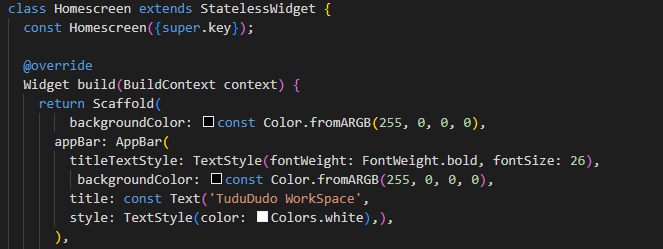
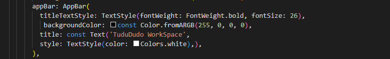
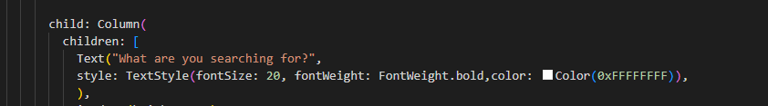
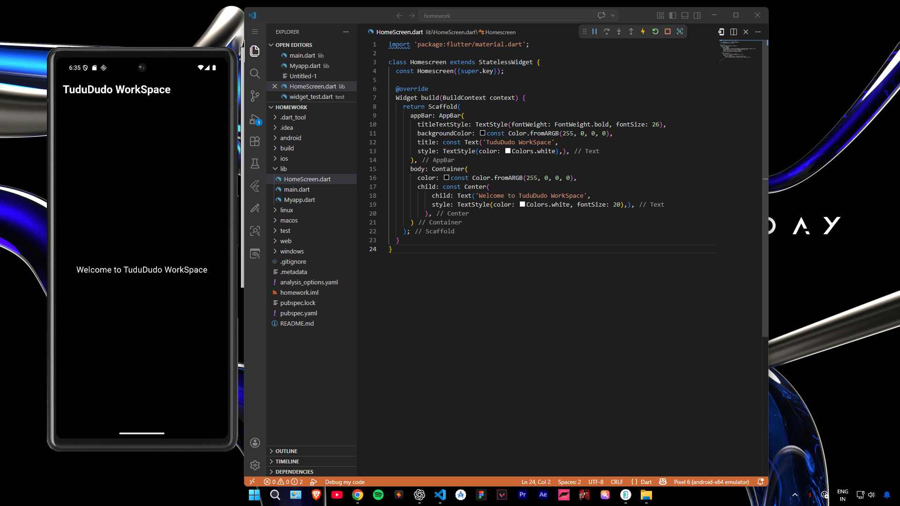
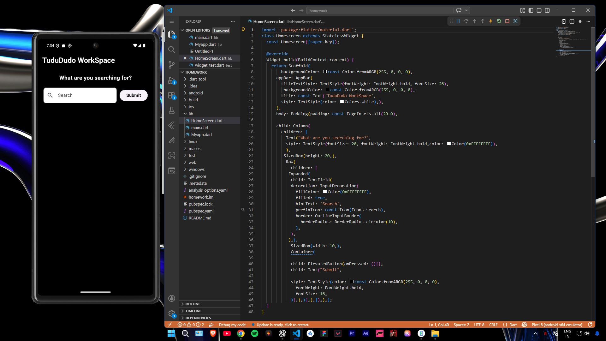

# Basic-Ui-Part-1
This project contains basic Flutter UI design examples. It includes simple layouts, widgets, and beginner-friendly UI components for learning purposes.

🚀 Features
Simple UI Design
Beginner Friendly Code
Clean Layout Structure
Reusable Widgets

🛠️ Technologies Used
Flutter
Dart

Scaffold

Appbar

Text

Container

Row & Column

All Final Basic Style apply

